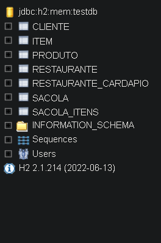

    </img>
    </img>

<h1 align="center">Sacola API</h1>

<h3 align="center">Arquitetura de uma Aplicação Spring Boot</h3>
</img>

---

<h3 align="center">TEMPLATE DO PROJETO</h3>
Para gerar a estrtura do projeto utilizaremos o [spring initializr](https://start.spring.io/)

</img>

# BANCO DE DADOS

- http://localhost:8081/h2-console/

    </img>
    </img>

